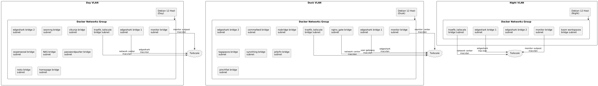
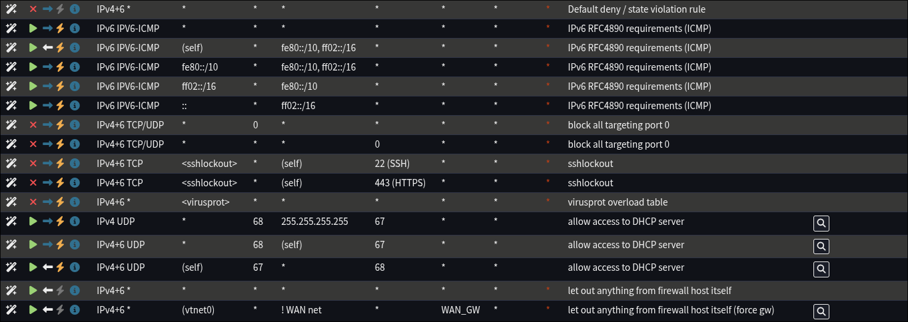
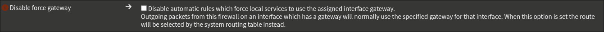
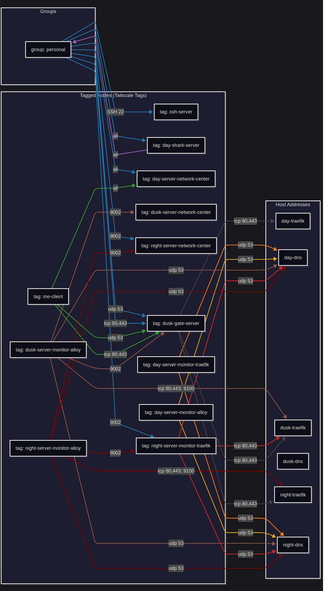

> [!important]
> ### ***What this document is and is not for.***
> 
> This document is meant to provide an accurate in-depth read of my network architecture and configuration state.
> 
> Reasoning behind decisions made in reaching this state is kept in this document.
> - [Decisions](./decisions.md)
> 
> Physical topology of my full home is kept in this document. 
> - [Physical Topology](./physical_topology.md)
> 
> An overview of traffic flow through my network as a whole is kept in this document.
> - [Traffic Flow](./traffic_flow.md)
---

# OPNSense: Firewall, VLANS, Subnets

| VLANs & Subnets  |
| ---------------- |
|  |

## Firewall

All VLANs below use the 802.1q protocol.

For firewall rules all VLANs inherit the default OPNSense rules and floating rules.

Default OPNSense

> [!tip]
>
> ***Explanation of OPNSense default rules.***
> - Default deny / state violation rule: if another rule allowing the traffic is not found, block the traffic
> 	- https://www.zenarmor.com/docs/network-security-tutorials/how-to-configure-opnsense-firewall-rules#what-is-opnsense-firewall-rule-order-and-direction-how-does-opnsense-process-the-rules
> ---
> - IPv6 RFC4890 requirements (ICMP): default secure allow IPv6 usage
> 	- https://www.reddit.com/r/opnsense/comments/uyaute/ipv6_wan_rules_for_icmp/
> 	- https://homenetworkguy.com/how-to/configure-ipv6-opnsense-with-isp-such-as-comcast-xfinity/
> - block all targeting port 0
>     - https://networkengineering.stackexchange.com/questions/11234/tcp-port-0-reserved-for-what-purpose
>     - https://www.lifewire.com/port-0-in-tcp-and-udp-818145
> - virusprot overload table: protection against brute force attacks
> ---
> - carp: recieves CARP packets and provides dedicated IP address for multiple networks
>     - this feature is meant for supporting a fail-over router
>     - https://docs.opnsense.org/manual/how-tos/carp.html
> ---
> - allow access to DHCP server: links to DHCP config, even if all outgoing traffic is specially managed, this will allow outgoing traffic to the DHCP server without requiring specific VLAN level allow rules
> ---
> - anti-lockout: allow access to router from any LAN address
>    - https://docs.opnsense.org/manual/firewall_settings.html#disable-anti-lockout
> ---
> - let out anything from firewall host itself (force gw): force use of set gateway for specific interfaces
> 
> 

Floating

All server VLANs are part of the SERVERS group giving them the below firewall rules. None of them have unique rules yet.

## VLAN Subnets & Assignments

> [!tip]
> ***Network Naming Schema Explained***
> 
> networks backends: `10.20.<macvlan-number>.<address-range>`
>- day: 1
>	- server: 0-6
>	- network center: 8-14
>	- undecided: 16-22
>	- edgeshark: 24-30
>	- monitor outpost: 32-38
> - dusk: 2
>	- server: 0-6
>	- network center: 8-14
>	- user gateway: 16-22
>	- edgeshark: 24-30
>	- monitor center: 32-38
> - night: 3
>	- server: 0-6
>	- network center: 8-14
>	- undecided: 16-22
>	- edgeshark: 24-30
>	- monitor outpost: 32-38

### Subnet Details
Those in use below.

| Name                  | Tag | Subnet Address (CIDR) | Default Gateway | Available Range |
| --------------------- | --- | --------------------- | --------------- | --------------- |
| Day                   | 101 | 10.20.1.0/29          | 10.20.1.1       | 2 - 6           |
| Day_Network_Center    | 102 | 10.20.1.8/29          | 10.20.1.9       | 10 - 14         |
| Day_Edgeshark         | 104 | 10.20.1.24/29         | 10.20.1.25      | 26 - 30         |
| Day_Monitor_Outpost   | 105 | 10.20.1.32/29         | 10.20.1.33      | 34 - 38         |
| Dusk                  | 201 | 10.20.2.0/29          | 10.20.2.1       | 2 - 6           |
| Dusk_Network_Center   | 202 | 10.20.2.8/29          | 10.20.2.9       | 10 - 14         |
| Dusk_User_Gateway     | 203 | 10.20.2.16/29         | 10.20.2.17      | 18 - 22         |
| Dusk_Edgeshark        | 204 | 10.20.2.24/29         | 10.20.2.25      | 26 - 30         |
| Dusk_Monitor_Center   | 205 | 10.20.2.32/29         | 10.20.2.33      | 34 - 38         |
| Night                 | 301 | 10.20.3.0/29          | 10.20.3.1       | 2 - 6           |
| Night_Network_Center  | 302 | 10.20.3.8/29          | 10.20.3.9       | 10 - 14         |
| Night_Edgeshark       | 304 | 10.20.3.24/29         | 10.20.3.25      | 26 - 30         |
| Night_Monitor_Outpost | 305 | 10.20.3.32/29         | 10.20.3.33      | 34 - 38         |

#### Assignments Details

> [!note] 
> ***Static DHCP Mappings for Host VMs***
>
> Used by `main.tf` files **for Terraform** to **generate interfaces**.

| VLAN Name             | MAC Address       | IP Address |
| --------------------- | ----------------- | ---------- |
| Day                   | 7a:7b:e2:51:43:90 | 10.20.1.6  |
| Day_Network_Center    | be:bb:37:47:6a:84 | 10.20.1.10 |
| Day_Edgeshark         | ee:76:24:18:a8:05 | 10.20.1.26 |
| Day_Monitor_Outpost   | ea:35:e6:41:05:21 | 10.20.1.34 |
| Dusk                  | unassigned        | unassigned |
| Dusk_Network_Center   | 0a:1a:19:4f:3d:a0 | 10.20.2.10 |
| Dusk_User_Gateway     | b6:36:f2:e6:16:65 | 10.20.2.18 |
| Dusk_Edgeshark        | c6:3c:cd:de:22:0a | 10.20.2.26 |
| Dusk_Monitor_Center   | ee:05:14:9c:4f:08 | 10.20.2.34 |
| Night                 | e6:20:5f:93:ec:ec | 10.20.3.6  |
| Night_Network_Center  | ca:42:3c:61:6d:8f | 10.20.3.10 |
| Night_Edgeshark       | 3e:1c:43:2e:50:5a | 10.20.3.26 |
| Night_Monitor_Outpost | 6a:c9:bd:ad:39:16 | 10.20.3.34 |

> [!note]
> ***Static DHCP Mappings for Containers***
> 
> Used in **host_vars Ansible files** to **generate Docker MACVLANs**.

| VLAN Name             | Host Name          | Sidecars Containers | Mac Address       | IP Address |
| --------------------- | ------------------ | ------------------- | ----------------- | ---------- |
| Day_Network_Center    | ts-network-center  | none                | c6:19:a8:7f:0e:39 | 10.20.1.11 |
| Day_Edgeshark         | ts-shark           | packetflix          | a6:d2:73:22:72:d5 | 10.20.1.27 |
| Day_Monitor_Outpost   | ts-monitor-outpost | traefik             | da:91:79:c6:65:b6 | 10.20.1.35 |
| Day_Monitor_Outpost   | ts-monitor-alloy   | alloy               | d6:cd:54:bc:a3:85 | 10.20.1.36 |
| Dusk_Network_Center   | ts-network-center  | none                | da:f3:16:64:f3:30 | 10.20.2.11 |
| Dusk_User_Gateway     | ts-gate            | nginx dnsmasq    | 56:9d:02:b2:98:a4 | 10.20.2.19 |
| Dusk_Edgeshark        | ts-shark           | packetflix          | ee:fc:b4:df:9e:9c | 10.20.2.27 |
| Dusk_Monitor_Center   | ts-monitor-center  | alloy               | 26:b9:e5:80:b3:c3 | 10.20.2.35 |
| Night_Network_Center  | ts-network-center  | none                | fe:56:b6:04:f0:db | 10.20.3.11 |
| Night_Edgeshark       | ts-shark           | packetflix          | 2a:ef:f6:79:56:48 | 10.20.3.27 |
| Night_Monitor_Outpost | ts-monitor-outpost | traefik             | 1a:7b:14:b8:0f:5d | 10.20.3.35 |
| Night_Monitor_Outpost | ts-monitor-alloy   | alloy               | 2a:d4:1a:0f:09:40 | 10.20.3.36 |

## Docker Networks

> [!note]
> ***Network Naming Schema Explained***
> 
> networks backends: `10.<vlan-number>.<backend-number>.address-range`
> duplicates are intentional where a service requires multiple networks
> macvlans obey naming scheme above for vlans
> - vlan & special group numbers
> 	- special interim server: 100
> 	- day: 110
> 	- dusk: 120
> 	- night: 130
> - backends - docker network subnets
> 	- network services: 0-19
> 		- traefik_tailscale: 0
> 		- dns: 1 (fix later: no longer in use)
> 		- edgeshark: 2
> 		- edgeshark: 3 (fix later: should be removed in future)
> 		- gate: 4 (fix later: hard coded into compose)
> 	- other operational services: 20-29
> 		- monitor center/outpost: 20
> 	- end services: 30-49
> 		- commafeed: 30
> 		- searxng: 31
> 		- expenseowl: 32
> 		- homepage: 33
> 		- vikunja: 34
> 		- jellyfin: 35

### Table of all docker networks currently in use.
> [!tip] 
> - using `#` instead of `{}` because this way table formats correctly
> - `#` is filled based on Network Naming Schema

| Host(s)      | Network Name           | Type    | Subnet Address (CIDR) | Default Gateway | Available Range |
| ------------ | ---------------------- | ------- | --------------------- | --------------- | --------------- |
| All          | traefik_tailscale      | Bridge  | 10.#.0.0/29           | 10.#.0.1        | 2 - 6           |
| All          | macvlan_network_center | Macvlan | 10.20.#.8/29          | 10.20.#.9       | 10 - 14         |
| day night | monitor_outpost        | Bridge  | 10.#.20.0/29          | 10.#.20.1       | 2 - 6           |
| day night | macvlan_outpost        | Macvlan | 10.20.#.32/29         | 10.20.#.33      | 34 - 38         |
| day          | t3_searxng             | Bridge  | 10.#.31.0/29          | 10.#.31.1       | 2 - 6           |
| day          | t3_vikunja             | Bridge  | 10.#.34.0/29          | 10.#.34.1       | 2 - 6           |
| dusk         | gate-tailscale-network | Bridge  | 10.110.4.0/29         | 10.110.4.1      | 2 - 6           |
| dusk         | macvlan_user_gate      | Macvlan | 10.20.2.16/29         | 10.20.2.17      | 18 - 22         |
| dusk         | monitor_center         | Bridge  | 10.120.20.0/28        | 10.120.20.1     | 2 - 6           |
| dusk         | macvlan_monitor_center | Macvlan | 10.20.2.32/29         | 10.20.2.33      | 34 - 38         |

> [!caution]
> Docker bridge network `gate-tailscale-network` is hard coded in the Docker Compose file with the subnet `10.110.4.0/29` which is using the VLAN # for Day even though it is in Dusk. This was missed when moving the service role and needs to be updated.

##### Host addresses in use within the above Docker Networks.
> [!tip] 
> - host addresses refers to the last number in the address here
> - the order of `Containers` and `IP Host Addresses` matches to pair each entry together
> - leaving Macvlan networks out of this since those assignments are documented in the above VLAN Assignments section

| Host(s)      | Network Name           | Containers                                                                   | IP Host Addresses                    |
| ------------ | ---------------------- | ---------------------------------------------------------------------------- | ------------------------------------ |
| All          | traefik_tailscale      | traefik tailscale dnsmasq                                              | 2 4 5                          |
| day night | monitor_outpost        | tailscale_traefik alloy                                                   | 2 3                               |
| day          | t3_searxng             | traefik searxng                                                           | 3 5                               |
| day          | t3_vikunja             | traefik vikunja                                                           | 3 5                               |
| dusk         | gate-tailscale-network | tailscale_nginx_dnsmasq                                                      | 2                                    |
| dusk         | monitor_center         | tailscale traefik dns grafana loki mimir alloy cadvisor | 2 3 4 5 6 7 8 9 |

> [!warning]
> - need to investigate if Tailscale Grants are pointing to the traefik instance in `monitor_center` network rather than `traefik_tailscale`
> - need to investigate why `traefik_tailscale` network skips a host address number and correct if unnecessary or document if so
> - should rename `alloy` network var to `tailscale_alloy` for the `monitor_outpost` network
> - need to move up the host addresses for end service t3 networks `t3_searxng` and `t3_vikunja`

---

# Tailscale: Overlay VPN

| Tailscale Mesh           |
| ------------------------ |
|  |

## Groups

| Group Name | Users                         |
| ---------- | ----------------------------- |
| personal   | my trusted devices            |
| family     | my immediate family           |
| outside    | anyone other than those above |

> [!note] 
> groups `family` and `outside` are not currently in use because
> - the homelab is not setup to support more people than me securely yet
> - because of the above I am currently the only user of my Homelab

## Tags & Hosts

### Tags

> [!tip] 
> - IP Addresses are set by the nodeAttrs block in the Tailscale Access Controls config.
> - IP Pool is used for assigned addresses to a given target, the target being a tag in my case

| Tag Name                     | Hosts Applied To                                                            | Device Network(s)                         | IP Pool                  |
| ---------------------------- | --------------------------------------------------------------------------- | ----------------------------------------- | ------------------------ |
| ssh-server                   | Each Proxmox VM                                                             | VLANs: Day,Dusk,Night                     | "100.80.0.0/29"          |
| day-shark-server             | does not exist currently  tailscale container + packetflix sidecar | does not exist currently  edgeshark | "100.80.31.1/32"         |
| day-server-network-center    | tailscale container                                                         | traefik_tailscale                         | does not exist currently |
| dusk-server-network-center   | tailscale container                                                         | traefik_tailscale                         | does not exist currently |
| night-server-network-center  | tailscale container                                                         | traefik_tailscale                         | does not exist currently |
| dusk-gate-server             | tailscale container + nginx sidecar                                      | gate-tailscale-network                    | "100.80.1.1/32"          |
| dusk-server-monitor-alloy    | tailscale container + alloy sidecar                                      | monitor_center                            | "100.80.20.3/32"         |
| day-server-monitor-traefik   | tailscale container + traefik sidecar                                    | monitor_outpost                           | "100.80.20.1/32"         |
| day-server-monitor-alloy     | tailscale container + alloy sidecar                                      | monitor_outpost                           | "100.80.20.2/32"         |
| night-server-monitor-traefik | tailscale container + traefik sidecar                                    | monitor_outpost                           | "100.80.20.4/32"         |
| night-server-monitor-alloy   | tailscale container + alloy sidecar                                      | monitor_outpost                           | "100.80.20.5/32"         |
| me-client                    | n/a                                                                         | n/a                                       | n/a                      |

> [!warning]
> - `day-shark-server` needs to be matched by tags for dusk and night, all with up to date nodeAttr IP Pool assignments
> - make IP Pool assignments for the network-center tags

### Host Addresses

| Host Name                     | IP Address  | Container_Network | Container_Name |
| ----------------------------- | ----------- | ----------------- | -------------- |
| day-traefik                   | 10.110.0.2  | traefik_tailscale | traefik        |
| day-dns                       | 10.110.0.5  | traefik_tailscale | dnsmasq        |
| day-monitor-outpost-traefik   | 10.110.20.2 | monitor_outpost   | traefik        |
| dusk-traefik                  | 10.120.0.2  | traefik_tailscale | traefik        |
| dusk-dns                      | 10.120.0.5  | traefik_tailscale | dnsmasq        |
| dusk-monitor-center-traefik   | 10.120.20.3 | monitor_center    | traefik        |
| night-traefik                 | 10.130.0.2  | traefik_tailscale | traefik        |
| night-dns                     | 10.130.0.5  | traefik_tailscale | dnsmasq        |
| night-monitor-outpost-traefik | 10.130.20.2 | monitor_outpost   | traefik        |

### Host Networks

| Host Name                 | Subnet         | Host Matching Docker_Network | Autoapproved True/Fasle | Tag Associated           |
| ------------------------- | -------------- | ------------------------------- | ----------------------- | --------------------------- |
| day-traefik-net           | 10.110.0.0/29  | day traefik_tailscale        | true                    | day-server-network-center   |
| day-monitor-outpost-net   | 10.110.20.0/29 | day monitor_outpost          | true                    | day-server-network-center   |
| dusk-monitor-center-net   | 10.120.20.0/28 | dusk monitor_center          | true                    | dusk-server-network-center  |
| night-traefik-net         | 10.130.0.0/29  | night traefik_tailscale      | true                    | night-server-network-center |
| night-monitor-outpost-net | 10.130.20.0/29 | night monitor_outpost        | true                    | night-server-network-center |

> [!warning]
> - Autoapprovers contains the below which does not have a `host` entry or in turn any `Grants` entries.
> 	- "10.120.0.0/29":  ["tag:dusk-server-network-center"], // traefik
> - investigate why network-center tag is used for Autoapproving monitor routes and fix if need be

## SSH
> [!note] 
> This rule allows my personal devices only to be used for sshing into all my Proxmox VMs with any user on them.

| Source         | Destination    | Users                       |
| -------------- | -------------- | --------------------------- |
| group:personal | tag:ssh-server | "autogroup:nonroot", "root" |

## Grants

### User Related

| Source                | Destination                      | Host Destination Network               | Protocols:Ports Allowed |
| --------------------- | -------------------------------- | ----------------------------------------- | ----------------------- |
| group:personal        | tag:ssh-server                   | VLANs: Day,Dusk,Night                     | *:22                    |
| group:personal        | tag:day-server-network-center    | day traefik_tailscale                  | \*:*                    |
| group:personal        | tag:day-shark-server             | does not exist currently  edgeshark | \*:*                    |
| group:personal        | tag:dusk-gate-server             | dusk gate-tailscale-network            | udp:53                  |
| group:personal        | tag:night-server-monitor-traefik | night monitor_outpost                  | *:9002                  |
| group:personal        | tag:night-server-network-center  | night traefik_tailscale                | *:9002                  |
| group:personal        | tag:dusk-gate-server             | dusk gate-tailscale-network            | tcp:80, tcp:443         |
| tag:me-client         | tag:day-server-network-center    | day traefik_tailscale                  | \*:*                    |
| tag:me-client         | tag:dusk-gate-server             | dusk gate-tailscale-network            | udp:53                  |
| tag:me-client         | tag:dusk-gate-server             | dusk gate-tailscale-network            | tcp:80, tcp:443         |
| tag: day-shark-server | group:personal                   | n/a                                       | \*:*                    |

> [!warning]
> Need to join grants for destination:`tag:dusk-gate-server`.

### Extra-VLAN Container to Container

| Source                           | Destination                     | Host Source Network   | Host Destination Network | Protocols:Ports Allowed |
| -------------------------------- | ------------------------------- | ------------------------ | --------------------------- | ----------------------- |
| tag:day-server-monitor-traefik   | host address: night-dns         | day monitor_outpost   | night tailscale_traefik  | udp:53                  |
| tag:day-server-monitor-alloy     | host address: night-dns         | day monitor_outpost   | night tailscale_traefik  | udp:53                  |
| tag:night-server-monitor-traefik | host address:day-dns            | night monitor_outpost |                             | udp:53                  |
| tag:night-server-monitor-traefik | host address:dusk-traefik       | night monitor_outpost | night tailscale_traefik  | tcp:80, tcp:443         |
| tag:night-server-monitor-alloy   | host address:day-dns            | night monitor_outpost | day tailscale_traefik    | udp:53                  |
| tag:dusk-gate-server             | host address: day-traefik    | dusk monitor_outpost  | day tailscale_traefik    | tcp:80, tcp:443         |
| tag:dusk-gate-server             | host address: night-traefik  | dusk                     | night                       | tcp:80, tcp:443         |

> [!warning]
> - Need to add grants for the day-monitor tags headed to monitor-center.
> - Investigate the udp:53 grants.
> - Why does `tag:night-server-monitor-traefik` reach out to `host address:dusk-traefik` instead of a new `host address:dusk-monitor-traefik` with a separate Traefik instance there.

### Intra-VLAN Container to Container

| Source                           | Destination                      | Source Network         | Destination Network    | Protocols:Ports Allowed  |
| -------------------------------- | -------------------------------- | ---------------------- | ---------------------- | ------------------------ |
| tag:day-server-monitor-traefik   | host address:day-dns             | monitor_outpost        | traefik_tailscale      | udp:53                   |
| tag:day-server-monitor-alloy     | host address:day-dns             | monitor_outpost        | traefik_tailscale      | udp:53                   |
| tag:dusk-server-monitor-alloy    | host address: dusk-traefik       | monitor_center         | traefik_tailscale      | tcp:80, tcp:443, \*:9100 |
| tag:dusk-server-monitor-alloy    | tag:dusk-gate-server             | monitor_center         | gate-tailscale-network | *:9002                   |
| tag:dusk-server-monitor-alloy    | tag:dusk-server-network-center   | monitor_center         | traefik_tailscale      | *:9002                   |
| tag:night-server-monitor-traefik | host address: night-dns          | monitor_outpost        | traefik_tailscale      | udp:53                   |
| tag:night-server-monitor-alloy   | host address: night-dns          | monitor_outpost        | traefik_tailscale      | udp:53                   |
| tag:night-server-monitor-alloy   | host address: night-traefik      | monitor_outpost        | traefik_tailscale      | tcp:80, tcp:443, \*:9100 |
| tag:night-server-monitor-alloy   | tag:night-server-monitor-traefik | monitor_outpost        | monitor_outpost        | *:9002                   |
| tag:night-server-monitor-alloy   | tag:night-server-network-center  | monitor_outpost        | traefik_tailscale      | *:9002                   |
| tag:dusk-gate-server             | host address: dusk-traefik       | gate-tailscale-network | traefik_tailscale      | tcp:80, tcp:443          |

> [!warning]
> - Investigate why no grants point to dusk-dns either here in Intra-VLAN grants and Extra-VLAN.
> - Investigate why the monitor-alloy tag can go to the `traefik_tailscale` network with more than `*:9100`.
> - `tag:day-server-monitor-alloy` needs grants allowing Intra-VLAN scraping.
> - Investigate why `tag:night-server-monitor-alloy` is using Tailscale to go to another container in its own Docker Network.

## Keys

Total keys used: 10

Note: A role can have multiple keys and in turn multiple tags (tag per key) only when there are multiple tailscale containers in that role.

#### Containers with ts_auth_key.

| Ansible Role Name | Key Details                              | Tailscale Sidecar Details                                                                             |
| ----------------- | ---------------------------------------- | ----------------------------------------------------------------------------------------------------- |
| network_center    | 1 key (accounting for all hosts 3 keys)  | no sidecars - single key "host-server-network-center"                                                 |
| nginx_gate        | 1 key (accounting for all hosts 1 key)   | nginx sidecar - single key "dusk-server-gate" dnsmasq sidecar - single key "dusk-server-gate"      |
| monitor_center    | 1 key (accounting for all hosts 1 key)   | alloy sidecar - single key "dusk-monitor-alloy"                                                       |
| monitor_outpost   | 2 keys (accounting for all hosts 4 keys) | traefik sidecar - first key "host-monitor-traefik" alloy sidecar - second key "host-monitor-alloy" |

To find them use (ctrl+f "TS_AUTHKEY: " case sensitive whole word) in this repo. It will show all docker composes where a Tailscale key is used.

## Outbound-Capable Tailscale Containers

| Container Name  | Capability Purpose                                                                                          |
| --------------- | ----------------------------------------------------------------------------------------------------------- |
| monitor_center  | alloy container (sidecar): to scrape traefik and tailscale container not in its local docker networks       |
| monitor_outpost | traefik container (sidecar): to send data to monitor_center                                                 |
| edgeshark       | packetflix (sidecar): requires outbound capability (back and forth of inbound outbound traffic) to function |
| nginx_gate      | nginx (sidecar): to forward traffic to the appropiate traefik container                                     |

> [!warning]
> Investigate the capability purpose of `dnsmasq container (sidecar)`. Test later with existing sidecar setup and advertised subnet setup.

## Direct Connections

Every Tailscale container has a Macvlan interface for supporting direct connections.

Pluses
- Using services that don't require internet access when the internet is down at home becomes possible.
- Speed is improved.
- Traffic analysis via packet capture is easier.
- Personal data not going through derp servers as much now.

Minuses
- Higher risk upon a compromised Tailscale container as it can reach outside it's given Docker networks. Note this is restricted by the access controls in Tailscale.
- The work involved in adding every new Tailscale container to my Homelab network goes up dramatically.

---

# DNS

TODO: dns write up ...

All Tailscale DNS usage is Split-DNS meaning the Tailscale DNS nameservers will only be used for the specified domain(s) they are paired with.

This project has three different domains for which Tailscale DNS is used, these are subdomains that treat any further domains after as part of the given listings (wildcard behavior)
- *.day.wiresndreams.dev
- *.dusk.wiresndreams.dev
- *.night.wiresndreams.dev

For each domain the associated nameservers are
1. nginx_gate dns: this is the user gate that filter incoming client traffic headed to service endpoints
2. network_center dns: this is the host specific dnsmasq instance in the network center that provides the traefik address in its network