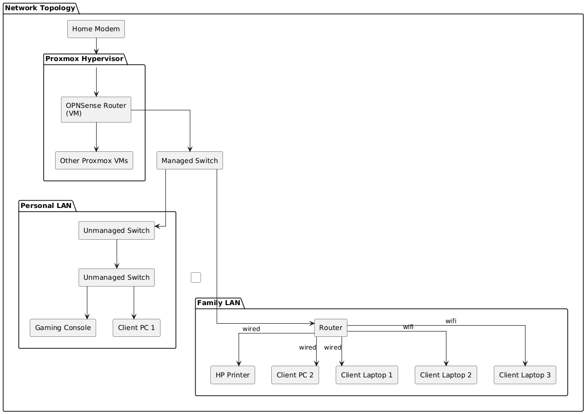

# Physical Topology: Full Home
---

| Physical Topology |
| ----------------- |
|   |

> [!important] Hardware Device Names Are Excluded Because:
> It feels uncomfortable to share model names even though reasonable guesses can be made of the specs provided here considering model specific vulnerabilities that can exist.

#### Modem Specifications
> [!important] location in house
> first floor networking equipment corner

| **Specification**         | **Details**                                          |
| ------------------------- | ---------------------------------------------------- |
| **DOCSIS Standard**       | DOCSIS 3.0                                           |
| **Channel Bonding**       | 16x4 channel bonding (upgradeable to 24x8)           |
| **Downstream Data Rate**  | Up to **960 Mbps**                                   |
| **Upstream Data Rate**    | Up to **240 Mbps**                                   |
| **VoIP Support**          | Yes, supports two independent phone lines            |
| **Ethernet Ports**        | 1 x RJ-45 Gigabit Ethernet port                      |
| **IPv4 and IPv6 Support** | Yes                                                  |
| **Power Requirements**    | AC power supply, supports options for battery backup |

> [!note] Explanation of Key Specifications
> ##### Channel Bonding
> - **16x4 Channel Bonding (Upgradeable to 24x8)**: This refers to the number of channels used for data transmission. The "16x4" means the modem can use **16 downstream channels** and **4 upstream channels** simultaneously. The configuration can be upgraded to **24 downstream channels** and **8 upstream channels**. More channels allow for increased bandwidth, which directly impacts internet speed and performance.
> ##### Downstream Data Rate
> - **Up to 960 Mbps**: This is the maximum speed at which data can be downloaded from the internet to your device. A higher downstream data rate means faster-loading web pages, quicker file downloads, and better streaming performance.
> ##### Upstream Data Rate
> - **Up to 240 Mbps**: This is the maximum speed at which data can be uploaded from your device to the internet. A higher upstream speed is particularly beneficial for activities like video conferencing, online gaming, and sending large files.
> ##### VoIP Support
> - **Supports Two Independent Phone Lines**: This means that the modem can handle two separate telephone lines using Voice over Internet Protocol (VoIP) technology. It allows users to make and receive calls over the internet using standard telephones without requiring a separate phone line.

#### Proxmox Machine
> [!note] 
> Proxmox is hosting my firewall OPNSense as a VM.
> Only relevant hardware specification details are listed here.

> [!important] location in house
> first floor by the desk

| **Specification** | **Name**          | **Details**                                                                                                                                                                                                                                                                                                                                                                                                                                                                                                                                                                                                                                                                |
| ----------------- | ----------------- | -------------------------------------------------------------------------------------------------------------------------------------------------------------------------------------------------------------------------------------------------------------------------------------------------------------------------------------------------------------------------------------------------------------------------------------------------------------------------------------------------------------------------------------------------------------------------------------------------------------------------------------------------------------------------- |
| **CPU**           | AMD Ryzen 5 3600  | 3.6 GHz 6-Cores 12-Threads                                                                                                                                                                                                                                                                                                                                                                                                                                                                                                                                                                                                                                                 |
| **Memory**        | MSI A520M PRO     | AMD AM4, DDR4, PCIe 4.0, SATA 6Gb/s, Dual M.2, USB 3.2 Gen 1, HDMI/DP, Micro-ATX, ‎4600 MHz Memory-Speed, Number of USB 2.0 Ports	‎2                                                                                                                                                                                                                                                                                                                                                                                                                                                                                                                                       |
| **Storage**       | G Skill Trident Z | 32 GB DDR4-3600                                                                                                                                                                                                                                                                                                                                                                                                                                                                                                                                                                                                                                                            |
| **NIC**           | n/a               | Controller: Realtek RTL8111H PCIe Gigabit LAN controller. Speed: 10/100/1000 Mbps (Gigabit Ethernet). Interface: PCI Express (integrated on the motherboard, no separate card required). Connector: 1 x RJ-45 port on the rear I/O panel.                                                                                                                                                                                                                                                                                                                                                                                                                         |
| **USB**           | n/a               | Rear USB ports 4 x USB 3.2 Gen 1 5 Gbps Type‑A ports on the back panel (from the AMD processor). ​ 2 x USB 2.0 Type‑A ports on the back panel. ​ Internal USB headers 1 x USB 3.2 Gen 1 5 Gbps header supporting 2 additional USB 3.2 Gen 1 ports (typically for front‑panel USB 3.0). ​ 2 x USB 2.0 headers supporting 4 additional USB 2.0 ports (typically for front‑panel USB 2.0 and internal devices).​  USB controller sources  USB 3.2 Gen 1 ports are provided by the AMD processor (rear 4x) and A520 chipset (2x via internal header).  USB 2.0 ports are provided by the AMD A520 chipset (2x rear, 4x via headers). |

##### Ethernet to USB Adapter
> used for traffic going to physical LAN, modem to here is wire to port direct 

| **Name**                       | **Details**                                  |
| ------------------------------ | -------------------------------------------- |
| UGREEN USB to Ethernet Adapter | 1Gbps Gigabit RJ45 to USB 3.0 Network Dongle |

##### OPNSense Proxmox VM Details
> [!note] Listing even though a VM due to important to network

| **Specification** | **Details** |
| ----------------- | ----------- |
| **CPU**           | 3 vCPU      |
| **Memory**        | 8 GB        |

#### Managed Switch
> [!important] location in house
> first floor by the desk

| **Specification**                  | **Details**                                                                                                                                                                                                                                                           |
| ---------------------------------- | --------------------------------------------------------------------------------------------------------------------------------------------------------------------------------------------------------------------------------------------------------------------- |
| **Management**                     | Web Managed                                                                                                                                                                                                                                                           |
| **Technical Config**               | Packet buffer 128KB Jumbo Frames 9k MAC Table 8K                                                                                                                                                                                                                |
| **Ethernet Ports**                 | 5 x RJ-45 Gigabit Ethernet port                                                                                                                                                                                                                                       |
| **Bandwidth**                      | 10Gbps                                                                                                                                                                                                                                                                |
| **Features**                       | VLAN support for traffic segmentation Quality of Service (QoS) for traffic prioritization Loop detection and broadcast storm controls Rate limiting for better bandwidth allocation Port mirroring for network monitoring Jumbo frame support |
| **VLAN (# Supported)**             | 64                                                                                                                                                                                                                                                                    |
| **IEEE 802.1Q VLAN Tagging**       | Yes                                                                                                                                                                                                                                                                   |
| **Port-based VLANs**               | Yes                                                                                                                                                                                                                                                                   |
| **Link Aggregation/Port Trunking** | No                                                                                                                                                                                                                                                                    |

#### Unmanaged Switch x2
> [!important] location in house
> first floor by the desk
> second floor, my room, my desk

| **Specification**            | **Details**                                                                                                                  |
| ---------------------------- | ---------------------------------------------------------------------------------------------------------------------------- |
| **Ethernet Ports**           | 8 x RJ-45 Gigabit Ethernet port                                                                                              |
| **Memory**                   | 128 KB RAM/ROM                                                                                                               |
| **Technical Config**         | Packet buffer 144KB Jumbo Frames 9,216 MAC Table 8K Throughput Up to 11.9 million pps Switching capacity 16 Gbps |
| **Quality of Service (QoS)** | IEEE 802.1p prioritization                                                                                                   |

#### Router
> [!important] location in house
> first floor networking equipment corner

| **Specification**       | **Details**                         |
| ----------------------- | ----------------------------------- |
| **SPI Firewall**        | yes                                 |
| **Ethernet Ports**      | 4 x RJ-45 Gigabit Ethernet port     |
| **Bands**               | Simultaneous 2.4 GHz and 5 GHz      |
| **Transmit/Receive**    | 2 x 3                               |
| **Wireless Speed**      | transfer rates up to 300 + 300 Mbps |
| **Wireless Encryption** | WPA/WPA2                            |
