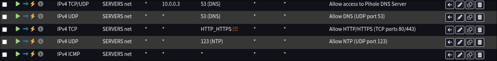

# My Isolation Approach

The participants in my network are
- users
- VM Hosts
- docker compose stacks by service
	- individual containers

For network travel these are the roads available.

| Travel Road              | Explanation of Reach                                                                                                                               | Management      |
| ------------------------ | -------------------------------------------------------------------------------------------------------------------------------------------------- | --------------- |
| Tailscale Mesh Network   | anything with IP address and Tailscale Outbound -> anything present in Tailscale Mesh Network, advertised or proper                             | Access Controls |
| OPNSense VLANs with DHCP | host <-> host host <-> container (with macvlan interface) container (with macvlan interface) <-> container (with macvlan interface) | Firewall Rules  |
| docker networks          | container <-> container (each in the same docker network)                                                                                       | Docker iptables |

 The **goals** here are to
 1. Make it so everything with IP address **can only reach** what it **needs** to be able to reach.
 2. Split the network participants based on trust and risk so that nothing leaks from a more risky part of the network or a risk user to important trusted parts of the Homelab.

As a result I have established and been following the below major rules in my Homelab which limit travel across the above roads.

| Rule                                                                                                                              | Any Exceptions to the Rule                                                                                                                                                                                                                                                                               |
| --------------------------------------------------------------------------------------------------------------------------------- | -------------------------------------------------------------------------------------------------------------------------------------------------------------------------------------------------------------------------------------------------------------------------------------------------------- |
| Every Proxmox VM interface (host interface and interfaces for docker macvlans) has its own VLAN from OPNSense.                    | Tailscale traffic over port 41641 is allowed between all server networks and my LAN network additionally as this provides Tailscale direct connection functionality.                                                                                                                                     |
| In every Docker Compose all their containers are kept within a custom external Docker bridge network specifically for that stack. | The main Traefik instance from the Ansible Role `network_center` and Docker Network `traefik_tailscale` is often given additional interfaces into other composes networks to be used in those networks additionally.  Additionally from the same role and network Tailscale is sometimes included. |
| Every Docker Compose has its own Dnsmasq instance for private records.                                                            | Tailscale DNS is used for Tailscale outbound capable containers.                                                                                                                                                                                                                                         |
| Users can only reach end services via the User-Gate to end Traefik proxy chain (refer to [Traffic Flow](link)).                   | Edgeshark which requires a direct two way connection with the user.                                                                                                                                                                                                                                      |
| Tailscale container to container access within the same host is allowed.                                                          | Tailscale container to container access across different hosts and in turn VLANs is allowed when going through a Traefik Proxy at both the entrance and exit points between the end services to the manage the traffic.                                                                                  |

# My Firewall Configuration

## IDS & IPS

OPNSense IDS & IPS Suricata Plugin
TODO: write this section up...
TODO: connect to filled in roadmap network lock-down section

## Rules

All VLANs use the `802.1q` protocol.

For firewall rules all VLANs inherit the default OPNSense rules and floating rules.

Default OPNSense

> [!tip]
>
> ***Explanation of OPNSense default rules.***
> - Default deny / state violation rule: if another rule allowing the traffic is not found, block the traffic
> 	- https://www.zenarmor.com/docs/network-security-tutorials/how-to-configure-opnsense-firewall-rules#what-is-opnsense-firewall-rule-order-and-direction-how-does-opnsense-process-the-rules
> ---
> - IPv6 RFC4890 requirements (ICMP): default secure allow IPv6 usage
> 	- https://www.reddit.com/r/opnsense/comments/uyaute/ipv6_wan_rules_for_icmp/
> 	- https://homenetworkguy.com/how-to/configure-ipv6-opnsense-with-isp-such-as-comcast-xfinity/
> - block all targeting port 0
>     - https://networkengineering.stackexchange.com/questions/11234/tcp-port-0-reserved-for-what-purpose
>     - https://www.lifewire.com/port-0-in-tcp-and-udp-818145
> - virusprot overload table: protection against brute force attacks
> ---
> - carp: recieves CARP packets and provides dedicated IP address for multiple networks
>     - this feature is meant for supporting a fail-over router
>     - https://docs.opnsense.org/manual/how-tos/carp.html
> ---
> - allow access to DHCP server: links to DHCP config, even if all outgoing traffic is specially managed, this will allow outgoing traffic to the DHCP server without requiring specific VLAN level allow rules
> ---
> - anti-lockout: allow access to router from any LAN address
>    - https://docs.opnsense.org/manual/firewall_settings.html#disable-anti-lockout
> ---
> - let out anything from firewall host itself (force gw): force use of set gateway for specific interfaces
> 
> 

Floating

All server VLANs are part of the SERVERS group giving them the below firewall rules. None of them have unique rules yet.

